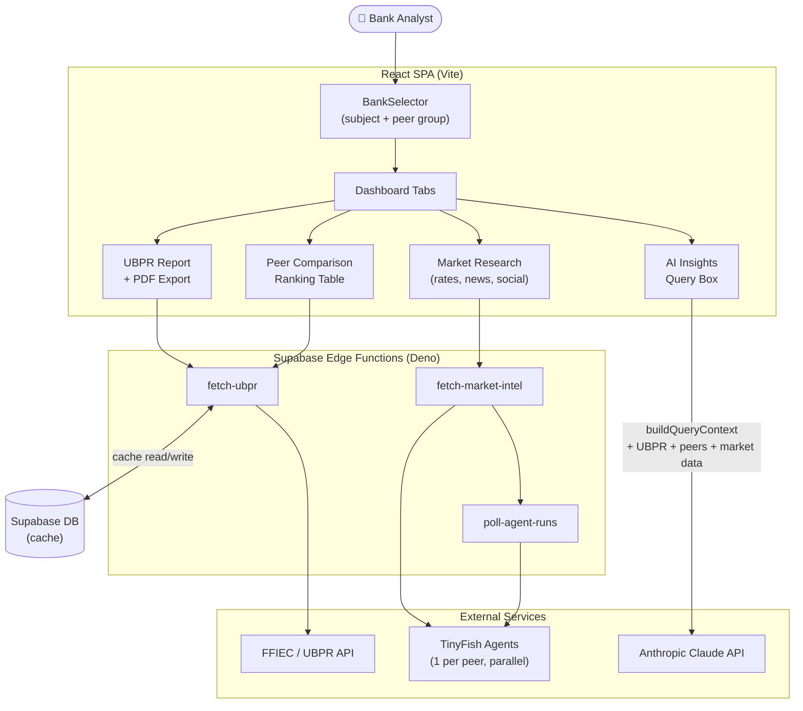

# PeerSweep

Competitive intelligence platform for community banks. PeerSweep lets bank executives select a subject bank and a peer group, then delivers regulatory performance benchmarks, live market research, and AI-generated strategic analysis — all in one dashboard.

## What it does

1. **FFIEC / UBPR Analysis** — Fetches quarterly Uniform Bank Performance Report data for any FDIC-regulated institution. Key metrics (ROA, NIM, efficiency ratio, Tier 1 capital, NPL ratio) are extracted, ranked against peers, and exportable as a PDF.

2. **Peer Comparison** — Side-by-side table ranking the subject bank against up to 25 peers on every major regulatory metric.

3. **Market Intelligence** — Dispatches one TinyFish AI agent per peer bank in parallel to scrape live deposit rates, recent Google News articles, and social media presence. Results stream back and aggregate in real time.

4. **AI Insights** — A natural-language query box that builds a rich prompt context from UBPR data, peer metrics, and market intel, then sends it to Claude for a grounded narrative response.

## Tech stack

| Layer | Technology |
|-------|-----------|
| Frontend | React 18 + TypeScript, Vite, Tailwind CSS, shadcn/ui |
| State / data fetching | TanStack React Query |
| Backend | Supabase Edge Functions (Deno) |
| Database | Supabase (PostgreSQL) |
| AI agents | TinyFish (parallel market research agents) |
| AI analysis | Anthropic Claude API |
| Charts | Recharts |
| PDF export | jsPDF + jsPDF AutoTable |
| Testing | Vitest (unit), Playwright (E2E) |

## Architecture



Edge functions handle all third-party calls. The frontend stays thin — it fetches, ranks, and renders. Market intel runs agents concurrently (one per peer) so a 10-bank peer group resolves in roughly the time it takes to research a single bank.

## Key design decisions

- **Parallel agent dispatch** — market research scales horizontally; each peer bank is an independent TinyFish job, not a sequential loop.
- **Context builder** (`src/lib/buildQueryContext.ts`) — formats UBPR metrics + peer data + market intel into a single structured prompt before sending to Claude, keeping AI responses grounded in real data.
- **Deterministic cache keys** — UBPR data is cached in Supabase keyed by `subjectRSSID + sorted peer RSSIDs`, so repeated queries for the same peer group never re-hit the FFIEC API.
- **Client-side PDF export** — UBPR reports render directly in the browser with jsPDF; no server round-trip needed.

## Local development

```bash
npm install
npm run dev        # start Vite dev server
npm run test       # Vitest unit tests
npx playwright test  # E2E tests
```

Requires `.env` with Supabase URL/anon key and an Anthropic API key. Copy `.env.example` and fill in values.

## Project structure

```
src/
├── components/        # Feature components + shadcn/ui primitives
├── pages/             # Index (dashboard), AdminUpload, NotFound
├── lib/
│   ├── api/           # Supabase function wrappers
│   ├── buildQueryContext.ts   # AI prompt assembly
│   └── generateUBPRPdf.ts     # PDF generation
├── data/bankData.ts   # Bank list loader (RSSD IDs, names, locations)
└── integrations/supabase/     # Generated types + client

supabase/functions/    # Deno edge functions
├── fetch-ubpr/        # FFIEC data + caching
├── fetch-market-intel/  # TinyFish agent orchestration
├── stream-market-intel/ # SSE streaming variant
├── poll-agent-runs/   # Agent status polling
└── analyze-deposit-behavior/
```
